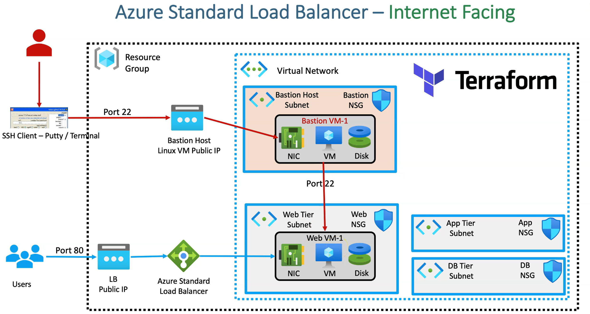
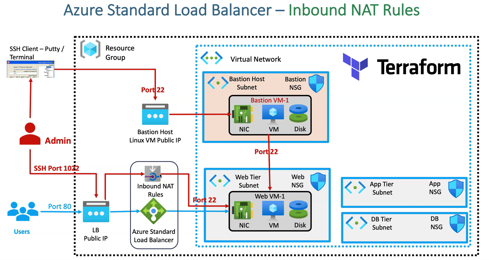

## Step-00: Introduction
- We are going to create Inbound NAT Rule for Standard Load Balancer in this demo
1. azurerm_lb_nat_rule
2. azurerm_network_interface_nat_rule_association
3. Verify the SSH Connectivity to Web Linux VM using Load Balancer Public IP with port 1022

## Step-01: c9-04-web-loadbalancer-inbound-nat-rules.tf
```t
# Azure LB Inbound NAT Rule
resource "azurerm_lb_nat_rule" "web_lb_inbound_nat_rule_22" {
  name                           = "ssh-1022-vm-22"
  protocol                       = "Tcp"
  frontend_port                  = 1022
  backend_port                   = 22
  frontend_ip_configuration_name = azurerm_lb.web_lb.frontend_ip_configuration[0].name  
  resource_group_name            = azurerm_resource_group.rg.name
  loadbalancer_id                = azurerm_lb.web_lb.id
}

# Associate LB NAT Rule and VM Network Interface
resource "azurerm_network_interface_nat_rule_association" "web_nic_nat_rule_associate" {
  network_interface_id  = azurerm_network_interface.web_linuxvm_nic.id
  ip_configuration_name = azurerm_network_interface.web_linuxvm_nic.ip_configuration[0].name 
  nat_rule_id           = azurerm_lb_nat_rule.web_lb_inbound_nat_rule_22.id
}
```

## Step-02: Execute Terraform Commands
```t
# Terraform Initialize
terraform init

# Terraform Validate
terraform validate

# Terraform Plan
terraform plan

# Terraform Apply
terraform apply -auto-approve
```

## Step-03: Verify Resources
```t
# Verify Resources - Virtual Network
1. Azure Resource Group
2. Azure Virtual Network
3. Azure Subnets (Web, App, DB, Bastion)
4. Azure Network Security Groups (Web, App, DB, Bastion)
5. View the topology
6. Verify Terraform Outputs in Terraform CLI

# Verify Resources - Web Linux VM 
1. Verify Network Interface created for Web Linux VM
2. Verify Web Linux VM
3. Verify Network Security Groups associated with VM (web Subnet NSG)
4. View Topology at Web Linux VM -> Networking
5. Verify if only private IP associated with Web Linux VM

# Verify Resources - Bastion Host
1. Verify Bastion Host VM Public IP
2. Verify Bastion Host VM Network Interface
3. Verify Bastion VM
4. Verify Bastion VM -> Networking -> NSG Rules
5. Verify Bastion VM Topology

# Connect to Bastion Host VM
1. Connect to Bastion Host Linux VM
ssh -i ssh-keys/terraform-azure.pem azureuser@<Bastion-Host-LinuxVM-PublicIP>
sudo su - 
cd /tmp
ls 
2. terraform-azure.pem file should be present in /tmp directory

# Connect to Web Linux VM using Bastion Host VM
1. Connect to Web Linux VM
ssh -i ssh-keys/terraform-azure.pem azureuser@<Web-LinuxVM-PrivateIP>
sudo su - 
cd /var/log
tail -100f cloud-init-output.log
cd /var/www/html
ls -lrt
cd /var/www/html/app1
ls -lrt
exit
exit

# Verify Standard Load Balancer Resources
1. Verify Public IP Address for Standard Load Balancer
2. Verify Standard Load Balancer (SLB) Resource
3. Verify SLB - Frontend IP Configuration
4. Verify SLB - Backend Pools
5. Verify SLB - Health Probes
6. Verify SLB - Load Balancing Rules
7. Verify SLB - Insights
8. Verify SLB - Diagnose and Solve Problems

# Access Application
http://<LB-Public-IP>
http://<LB-Public-IP>/app1/index.html
http://<LB-Public-IP>/app1/metadata.html
```
## Step-04: Verify Inbound NAT Rules for Port 22
```t
# Verify Inbound NAT Rules
ssh -i ssh-keys/terraform-azure.pem -p 1022 azureuser@<LB-Public-IP>

# Sample Output
Kalyans-Mac-mini:terraform-manifests kalyanreddy$ ssh -i ssh-keys/terraform-azure.pem -p 1022 azureuser@20.62.148.40
The authenticity of host '[20.62.148.40]:1022 ([20.62.148.40]:1022)' can't be established.
ECDSA key fingerprint is SHA256:Yeu9uyLui6lzMtBFvmxgy5A3ILfE1oXag6RAgTOH+R8.
Are you sure you want to continue connecting (yes/no/[fingerprint])? yes
Warning: Permanently added '[20.62.148.40]:1022' (ECDSA) to the list of known hosts.
Activate the web console with: systemctl enable --now cockpit.socket

This system is not registered to Red Hat Insights. See https://cloud.redhat.com/
To register this system, run: insights-client --register

[azureuser@hr-dev-web-linuxvm ~]$ 

```

## Step-04: Delete Resources
```t
# Delete Resources
terraform destroy 
[or]
terraform apply -destroy -auto-approve

# Clean-Up Files
rm -rf .terraform* 
rm -rf terraform.tfstate*
```


