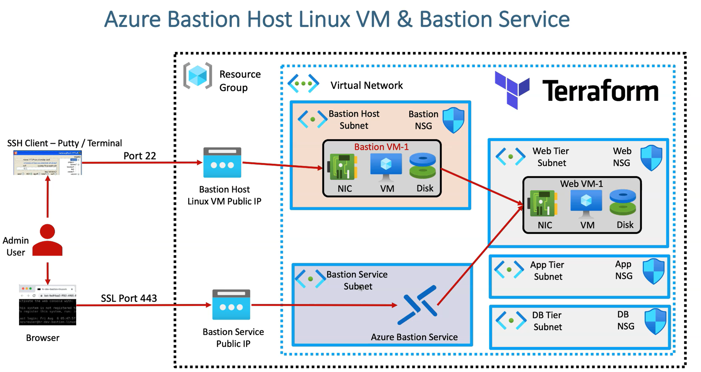
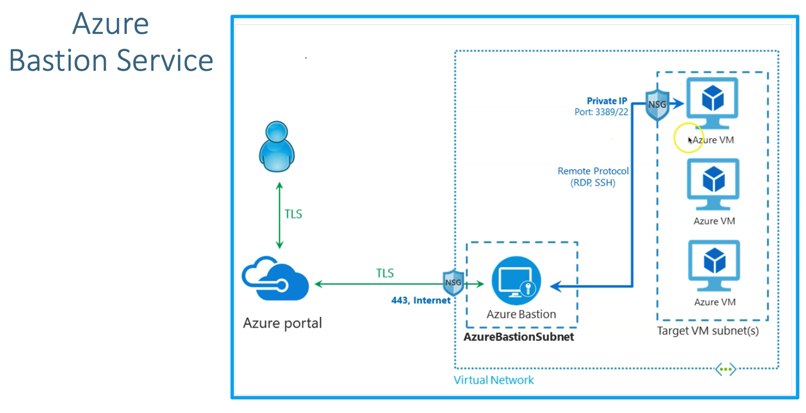

## Step-00: Introduction
- We are going to create two important Bastion Resources 
1. Azure Bastion Host 
2. Azure Bastion Service 
- We are going to use following Azure Resources for the same.
1. Terraform Input Variables
2. azurerm_public_ip
3. azurerm_network_interface
4. azurerm_linux_virtual_machine
5. Terraform Null Resource `null_resource`
6. Terraform File Provisioner
7. Terraform remote-exec Provisioner
8. azurerm_bastion_host
9. Terraform Output Values


## Pre-requisite Note: Create SSH Keys for Azure Linux VM
```t
# Create Folder
cd terraform-manifests/
mkdir ssh-keys

# Create SSH Key
cd ssh-ekys
ssh-keygen \
    -m PEM \
    -t rsa \
    -b 4096 \
    -C "azureuser@myserver" \
    -f terraform-azure.pem 
Important Note: Please don't provide any passhprase, as the passphrase is not supported on latest provider versions

# List Files
ls -lrt ssh-keys/

# Files Generated after above command 
Public Key: terraform-azure.pem.pub -> Rename as terraform-azure.pub
Private Key: terraform-azure.pem

# Permissions for Pem file
chmod 400 terraform-azure.pem
```

## Step-01: c8-01-bastion-host-input-variables.tf
```t
# Bastion Linux VM Input Variables Placeholder file.
variable "bastion_service_subnet_name" {
  description = "Bastion Service Subnet Name"
  default = "AzureBastionSubnet"
}
variable "bastion_service_address_prefixes" {
  description = "Bastion Service Address Prefixes"
  default = ["10.0.101.0/27"]
}
```

## Step-02: c8-02-bastion-host-linuxvm.tf
```t
# Resource-1: Create Public IP Address
resource "azurerm_public_ip" "bastion_host_publicip" {
  name                = "${local.resource_name_prefix}-bastion-host-publicip"
  resource_group_name = azurerm_resource_group.rg.name
  location            = azurerm_resource_group.rg.location
  allocation_method   = "Static"
  sku = "Standard"
}

# Resource-2: Create Network Interface
resource "azurerm_network_interface" "bastion_host_linuxvm_nic" {
  name                = "${local.resource_name_prefix}-bastion-host-linuxvm-nic"
  location            = azurerm_resource_group.rg.location
  resource_group_name = azurerm_resource_group.rg.name

  ip_configuration {
    name                          = "bastion-host-ip-1"
    subnet_id                     = azurerm_subnet.bastionsubnet.id
    private_ip_address_allocation = "Dynamic"
    public_ip_address_id = azurerm_public_ip.bastion_host_publicip.id 
  }
}

# Resource-3: Azure Linux Virtual Machine - Bastion Host
resource "azurerm_linux_virtual_machine" "bastion_host_linuxvm" {
  name = "${local.resource_name_prefix}-bastion-linuxvm"
  #computer_name = "bastionlinux-vm"  # Hostname of the VM (Optional)
  resource_group_name = azurerm_resource_group.rg.name
  location = azurerm_resource_group.rg.location
  size = "Standard_DS1_v2"
  admin_username = "azureuser"
  network_interface_ids = [ azurerm_network_interface.bastion_host_linuxvm_nic.id ]
  admin_ssh_key {
    username = "azureuser"
    public_key = file("${path.module}/ssh-keys/terraform-azure.pub")
  }
  os_disk {
    caching = "ReadWrite"
    storage_account_type = "Standard_LRS"
  }
  source_image_reference {
    publisher = "RedHat"
    offer = "RHEL"
    sku = "83-gen2"
    version = "latest"
  }
}
```

## Step-03: c8-03-move-ssh-key-to-bastion-host.tf
### Step-03-01: Add Null Provider in c1-versions.tf
```t
# Terraform Block
terraform {
  required_version = ">= 1.0.0"
  required_providers {
    azurerm = {
      source = "hashicorp/azurerm"
      version = ">= 2.0" 
    }
    random = {
      source = "hashicorp/random"
      version = ">= 3.0"
    }
    null = {
      source = "hashicorp/null"
      version = ">= 3.0"
    }     
  }
}
```
### Step-03-02: Add Null Resource and Terraform Provisioners
```t
# Create a Null Resource and Provisioners
resource "null_resource" "name" {
  depends_on = [azurerm_linux_virtual_machine.bastionlinuxvm]
# Connection Block for Provisioners to connect to Azure VM Instance
  connection {
    type = "ssh"
    host = azurerm_linux_virtual_machine.bastionlinuxvm.public_ip_address
    user = azurerm_linux_virtual_machine.bastionlinuxvm.admin_username
    private_key = file("${path.module}/ssh-keys/terraform-azure.pem")
  }

## File Provisioner: Copies the terraform-key.pem file to /tmp/terraform-key.pem
  provisioner "file" {
    source      = "ssh-keys/terraform-azure.pem"
    destination = "/tmp/terraform-azure.pem"
  }
## Remote Exec Provisioner: Using remote-exec provisioner fix the private key permissions on Bastion Host
  provisioner "remote-exec" {
    inline = [
      "sudo chmod 400 /tmp/terraform-azure.pem"
    ]
  }
}

# Creation Time Provisioners - By default they are created during resource creations (terraform apply)
# Destory Time Provisioners - Will be executed during "terraform destroy" command (when = destroy)
```

## Step-04: c8-04-AzureBastionService.tf
```t

# Azure Bastion Service - Resources
## Resource-1: Azure Bastion Subnet
resource "azurerm_subnet" "bastion_service_subnet" {
  name                 = var.bastion_service_subnet_name
  resource_group_name  = azurerm_resource_group.rg.name
  virtual_network_name = azurerm_virtual_network.vnet.name
  address_prefixes     = var.bastion_service_address_prefixes
}

# Resource-2: Azure Bastion Public IP
resource "azurerm_public_ip" "bastion_service_publicip" {
  name                = "${local.resource_name_prefix}-bastion-service-publicip"
  location            = azurerm_resource_group.rg.location
  resource_group_name = azurerm_resource_group.rg.name
  allocation_method   = "Static"
  sku                 = "Standard"
}

# Resource-3: Azure Bastion Service Host
resource "azurerm_bastion_host" "bastion_host" {
  name                = "${local.resource_name_prefix}-bastion-service"
  location            = azurerm_resource_group.rg.location
  resource_group_name = azurerm_resource_group.rg.name

  ip_configuration {
    name                 = "configuration"
    subnet_id            = azurerm_subnet.bastion_service_subnet.id
    public_ip_address_id = azurerm_public_ip.bastion_service_publicip.id
  }
}

```

## Step-05: c8-05-bastion-outputs.tf
```t
## Bastion Host Public IP Output
output "bastion_host_linuxvm_public_ip_address" {
  description = "Bastion Host Linux VM Public Address"
  value = azurerm_public_ip.bastion_host_publicip.ip_address
}
```

## Step-06: terraform.tfvars
```t
# Newly added
bastion_service_subnet_name = "AzureBastionSubnet"
bastion_service_address_prefixes = ["10.1.101.0/27"]
```

## Step-07: Remove Public Access to Web Linux VM
- In this section and upcoming sections, we will not need internet fronting for Web Linux VM.
- Here in this section we will remove the internet fronting for this linux vm by removing public IP Association.
- Test the SSH Connectivity to Web Linux VM using 
1. Azure Bastion Host Linux VM
2. Azure Bastion Service
### Step-07-01: Comment c7-02-web-linuxvm-publicip.tf
```t
/*
# Resource-1: Create Public IP Address
resource "azurerm_public_ip" "web_linuxvm_publicip" {
  name                = "${local.resource_name_prefix}-web-linuxvm-publicip"
  resource_group_name = azurerm_resource_group.rg.name
  location            = azurerm_resource_group.rg.location
  allocation_method   = "Static"
  sku = "Standard"
  #domain_name_label = "app1-vm-${random_string.myrandom.id}"
}
*/
```

### Step-07-02: c7-03-web-linuxvm-network-interface.tf
- Comment public IP association related argument in Network Interface Resource `public_ip_address_id = azurerm_public_ip.web_linuxvm_publicip.id`

```t
# Resource-2: Create Network Interface
resource "azurerm_network_interface" "web_linuxvm_nic" {
  name                = "${local.resource_name_prefix}-web-linuxvm-nic"
  location            = azurerm_resource_group.rg.location
  resource_group_name = azurerm_resource_group.rg.name

  ip_configuration {
    name                          = "web-linuxvm-ip-1"
    subnet_id                     = azurerm_subnet.websubnet.id
    private_ip_address_allocation = "Dynamic"
    #public_ip_address_id = azurerm_public_ip.web_linuxvm_publicip.id 
  }
}
```

### Step-07-03: c7-06-web-linuxvm-outputs.tf
- Comment Outputs related to Public IP Address
```t
/*
## Public IP Address
output "web_linuxvm_public_ip" {
  description = "Web Linux VM Public Address"
  value = azurerm_public_ip.web_linuxvm_publicip.ip_address
}
*/
# Linux VM Outputs
/*
## Virtual Machine Public IP
output "web_linuxvm_public_ip_address" {
  description = "Web Linux Virtual Machine Public IP"
  value = azurerm_linux_virtual_machine.web_linuxvm.public_ip_address
}
*/
```


## Step-08: Execute Terraform Commands
```t
# Terraform Initialize
terraform init

# Terraform Validate
terraform validate

# Terraform Plan
terraform plan

# Terraform Apply
terraform apply -auto-approve

# Important Note: 
1. Azure Bastions Service takes 10 to 15 minutes to create. 
```

### Important Note about Azure Bastion Service
- It takes close to 10 to 15 minutes to create this service.
```log
azurerm_bastion_host.bastion_host: Still creating... [10m50s elapsed]
azurerm_bastion_host.bastion_host: Still creating... [11m0s elapsed]
azurerm_bastion_host.bastion_host: Still creating... [11m10s elapsed]
azurerm_bastion_host.bastion_host: Still creating... [11m20s elapsed]
azurerm_bastion_host.bastion_host: Still creating... [11m30s elapsed]
azurerm_bastion_host.bastion_host: Creation complete after 11m35s [id=/subscriptions/82808767-144c-4c66-a320-b30791668b0a/resourceGroups/hr-dev-rg/providers/Microsoft.Network/bastionHosts/hr-dev-bastion-service]

Apply complete! Resources: 36 added, 0 changed, 0 destroyed.
```

## Step-09: Verify Resources - Bastion Host
```t
# Verify Resources - Virtual Network
1. Azure Resource Group
2. Azure Virtual Network
3. Azure Subnets (Web, App, DB, Bastion)
4. Azure Network Security Groups (Web, App, DB, Bastion)
5. View the topology
6. Verify Terraform Outputs in Terraform CLI

# Verify Resources - Web Linux VM 
1. Verify Network Interface created for Web Linux VM
2. Verify Web Linux VM
3. Verify Network Security Groups associated with VM (web Subnet NSG)
4. View Topology at Web Linux VM -> Networking
5. Verify if only private IP associated with Web Linux VM

# Verify Resources - Bastion Host
1. Verify Bastion Host VM Public IP
2. Verify Bastion Host VM Network Interface
3. Verify Bastion VM
4. Verify Bastion VM -> Networking -> NSG Rules
5. Verify Bastion VM Topology

# Connect to Bastion Host VM
1. Connect to Bastion Host Linux VM
ssh -i ssh-keys/terraform-azure.pem azureuser@<Bastion-Host-LinuxVM-PublicIP>
sudo su - 
cd /tmp
ls 
2. terraform-azure.pem file should be present in /tmp directory

# Connect to Web Linux VM using Bastion Host VM
1. Connect to Web Linux VM
ssh -i ssh-keys/terraform-azure.pem azureuser@<Web-LinuxVM-PrivateIP>
sudo su - 
cd /var/log
tail -100f cloud-init-output.log
cd /var/www/html
ls -lrt
cd /var/www/html/app1
ls -lrt
exit
exit
```

## Step-10: Verify Resources - Bastion Service
```t
# Verify Azure Bastion Service
1. Go to Azure Management Porta Console -> Bastions
2. Verify Bastion Service -> hr-dev-bastion-service
3. Verify Settings -> Sessions
4. Verify Settings -> Configuration

# Connect to Web Linux VM using Bastion Service
1. Go to Web Linux VM using Azure Portal Console
2. Portal Console -> Virtual machines -> hr-dev-web-linuxvm ->Settings -> Connect
3. Select "Bastion" tab -> Click on "Use Bastion"
- Open in new window: checked
- Username: azureuser
- Authentication Type: SSH Private Key from Local File
- Local File: Browse from ssh-keys/terraform-azure.pem
- Click on Connect
4. In new tab, we should be logged in to VM "hr-dev-web-linuxvm" 
5. Run additional commands
sudo su - 
cd /var/www/html
ls 
cd /var/www/html/app1
ls

# Verify Bastion Sessions 
1. Go to Azure Management Porta Console -> Bastions
2. Verify Bastion Service -> hr-dev-bastion-service
3. Verify Settings -> Sessions
```

## Step-11: Delete Resources
```t
# Delete Resources
terraform destroy 
[or]
terraform apply -destroy -auto-approve

# Clean-Up Files
rm -rf .terraform* 
rm -rf terraform.tfstate*
```


